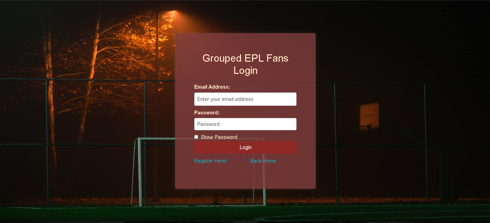

# Football Fan Membership Platform

A membership-based football fan platform built with PHP, MySQL, JavaScript and Bootstrap.

The platform allows users to register, log in, access membership features and view football-related content, while administrators can manage users and membership-related activities.

## Key Features

- User registration and login
- Membership-based access to premium content
- Football news and live match-related pages
- Admin and staff dashboard areas
- Membership management
- Responsive interface using Bootstrap

## Technologies Used

- PHP
- MySQL
- HTML5
- CSS3
- JavaScript
- Bootstrap
- jQuery
- XAMPP

## Local Setup

1. Install XAMPP.
2. Place the project folder inside the XAMPP `htdocs` directory.
3. Start Apache and MySQL from the XAMPP Control Panel.
4. Copy `dbconfig.example.php` to `dbconfig.php`.
5. Update the database credentials in `dbconfig.php`.
6. Open the project in your browser using your local XAMPP URL.

## Database Note

The MySQL database schema and data are not included in this repository.  
A compatible local database must be created or imported separately before running the application.

Local database credentials are excluded from version control. Use `dbconfig.example.php` as a template for your own `dbconfig.php`.

## Project Structure

```text
new_grouped_epl_fans/
├── admin/                  # Admin area
├── dashboard/              # User dashboard
├── staffdashboard/         # Staff dashboard
├── header,footerandcss/     # Shared layout and styling files
├── img/                    # Project images
├── Vendor/                 # Frontend libraries and assets
├── index.php               # Main entry page
├── login.php               # User login
├── register.php            # User registration
├── membership.php          # Membership page
├── membership_process.php  # Membership processing logic
├── football_news.php       # Football news page
├── live_football_match.php # Live match-related page
├── dbconfig.example.php    # Database configuration template
└── .gitignore              # Files excluded from Git
```
## Screenshots

### Homepage


### User Login


### Membership


### Admin Login
